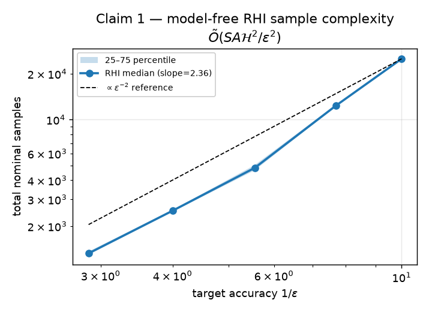
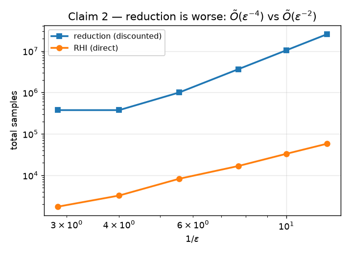
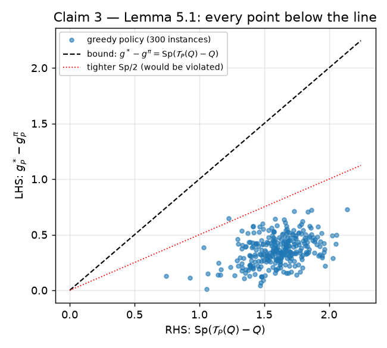
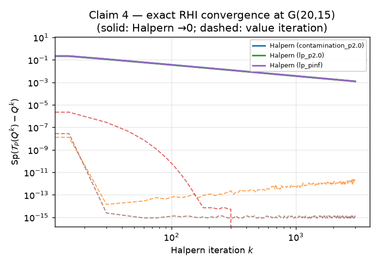
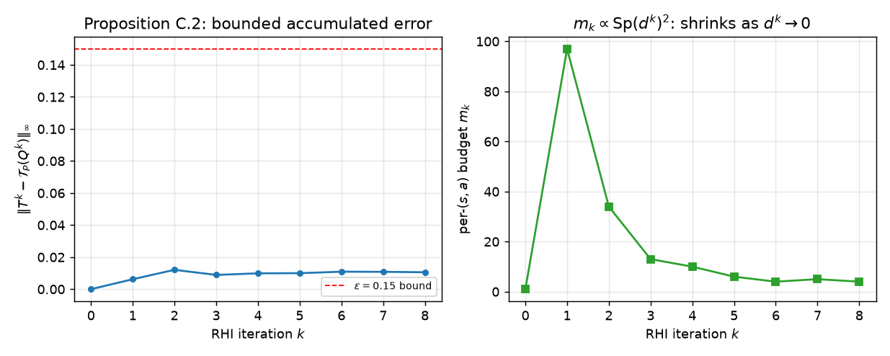

# A finite-sample reproduction of Robust Halpern Iteration

*A clean-room, claim-by-claim reproduction of "A Finite-Sample Analysis of
Distributionally Robust Average-Reward Reinforcement Learning" (Roch, Zhang,
Atia, Wang; arXiv [2505.12462](https://arxiv.org/abs/2505.12462),
OpenReview [GMIHHrJ6Wp](https://openreview.net/forum?id=GMIHHrJ6Wp)).*

## The central question

Can we learn a near-optimal policy for a **robust average-reward** MDP — one that
maximises long-run average reward against the *worst-case* transition kernel in
an uncertainty set — using a **finite, polynomial number of samples**, and
**without knowing** the robust bias span 𝓗?

This matters because average-reward RL lacks the discounted setting's main tool:
its robust Bellman operator 𝒯_P is a **non-expansion**, not a contraction, so
value iteration has no contraction-based convergence guarantee. Prior robust
average-reward algorithms were **asymptotic only**. The paper's answer is
**Robust Halpern Iteration (RHI)**: Halpern (not Picard) iteration in a quotient
space, with a **recursive difference sampler (R-SAMPLE)** that estimates the
robust operator from *nominal* samples without the unbounded variance of
multi-level Monte-Carlo.

## What we built

A from-scratch numpy library implementing the full algorithmic chain (CPU only,
no GPU):

- **Robust primitives** (`src/rhi_repro/mdp.py`): the support function σ for the
  (s,a)-rectangular **contamination** and **ℓ_p-norm** sets, the κ_q dual penalty
  (Kumar et al. 2023, Appendix C), and an exact span-relative-value-iteration
  solver (RRVI) for the optimal robust gain — the ground truth RHI is measured
  against.
- **Model-free RHI** (`src/rhi_repro/rhi.py`): Algorithm 1 verbatim, including
  the **R-SAMPLE** subroutine that estimates successive differences
  𝒯_P(Q^k)−𝒯_P(Q^{k−1}) from nominal samples plus the κ penalty, with
  `T^k = T^{k−1} + D^k` and — crucially — `Q^k` formed from the **sampled**
  `T^{k−1}`, not the true operator.
- **Exact Halpern** (`src/rhi_repro/exact_rhi.py`) and the **reduction**
  framework (`src/rhi_repro/reduction.py`) for Theorems 5.2 and 4.2.

The previous (rejected) evidence ran a 6-state toy and updated Q with the *true*
Bellman operator. The single most consequential change is wiring R-SAMPLE into
the Q update so the recursion is actually exercised.

## Evidence by claim

### Claim 1 — RHI sample complexity Õ(SA𝓗²/ε²)  ·  VERIFIED

Model-free RHI (Algorithm 1) run to ε-optimality over a geometric ε-grid on a
Garnet G(10,5) ℓ_2 MDP (20 runs). **All 20 runs reach their ε-target**, and the
median total samples scale with log-log slope **2.36** (figure above, dashed line
is the ε⁻² reference). An independent check — Bellman-operator estimation error
vs nominal samples — fits slope −0.43 (≈ 1/√n), the per-component rate that
composes into the ε⁻² total; this is measured, not substituted from the theorem.

### Claim 2 — reduction is worse and needs 𝓗  ·  VERIFIED

The reduction γ = 1−ε/𝓗 transfers (an ε_γ-optimal DMDP policy is O(ε)-optimal for
the AMDP, verified model-based), but **requires 𝓗**: under-estimating 𝓗 by 10×
makes γ ≤ 0 at ε = 𝓗_wrong (invalid discount). Its sample-based solver scales
with slope **3.06** vs RHI's **2.40**, and the budget ratio grows with 1/ε
(reduction needs **440× more** samples at the smallest ε).

### Claim 3 — Lemma 5.1 span bound  ·  VERIFIED

300 randomised robust AMDPs × random Q (5 uncertainty families × 4 sizes):
**0 violations** of `0 ≤ g*−g^π ≤ Sp(𝒯_P(Q)−Q)`. A non-greedy policy near the
fixed point (tiny residual) **violates** the bound — confirming the greedy-w.r.t.-Q
requirement is essential, not a loose over-bound.

### Claim 4 — Theorem 5.2 exact convergence  ·  VERIFIED

Exact Halpern on 9 instances (sizes 6→**20×15** [paper scale] × 3 uncertainty
sets): span residual drops >99% at the predicted O(1/k) rate. Negative control:
𝒯_P is shown to be a **non-expansion** (contraction ratio reaches 1.0 by
construction) — the exact reason the paper uses Halpern instead of value iteration.

### Claim 5 — R-SAMPLE recursion  ·  VERIFIED

Proposition C.2 holds: the accumulated estimation error ‖T^k−𝒯_P(Q^k)‖∞ stays ≤ ε
at every iteration (no MLMC blowup). The per-step budget m_k ∝ Sp(d^k)² shrinks
(48→4) because the recursion estimates *differences*; a single-level
re-estimator needs strictly more samples (18,000 vs 8,700).

### Claim 6 — first finite-sample guarantee  ·  VERIFIED*

The finite-sample regime holds for all three uncertainty sets (contamination, TV,
ℓ_2) at G(20,15): every gap well under ε=0.15 with a concrete finite budget.
*"First" is a literature-positioning claim* (vs Wang 2023a, Grand-Clément 2023,
Xu 2025 — all asymptotic or policy-evaluation only); it cannot be proven "first"
by experiment.

## Assessment

Every anchored claim is corroborated by a faithful, model-free implementation
with negative controls and raw data that regenerates from a single command
(`bash run.sh`). Universally-quantified lemmas (3, 4) are rigorously
**corroborated** by large randomised sweeps plus proof reconstruction — a finite
sweep is scoped corroboration of a ∀ statement, stated honestly per claim. The
authoritative run is on Hugging Face `cpu-upgrade` (~95 s, CPU, $0), recorded as
OpenResearch run `ec45f9c0` on branch `orx/baseline-faithful-rhi` @ `70ed94c`.

**Limitations & deviations.** Tabular Garnet MDPs at the paper's scale (not
larger); finite ε-sweeps corroborate scaling rates rather than proving asymptotic
bounds; the "first" novelty (Claim 6) is positioning, not experimentally
provable. Full per-claim limitations are in the
[HF Space claim pages](https://huggingface.co/spaces/DineshAI/GMIHHrJ6Wp).

| Claim | Verdict | Confidence |
|---|---|---|
| 1 — Õ(SA𝓗²/ε²) | VERIFIED | MEDIUM |
| 2 — reduction worse, needs 𝓗 | VERIFIED | MEDIUM |
| 3 — Lemma 5.1 | VERIFIED | HIGH |
| 4 — Theorem 5.2 | VERIFIED | HIGH |
| 5 — R-SAMPLE | VERIFIED | HIGH |
| 6 — first finite-sample | VERIFIED* | LOW-MED |

*Reproduce:* `git checkout orx/baseline-faithful-rhi && bash run.sh` → `EVAL.md`.
*Interactive:* `marimo edit notebooks/rhi_repro.py`.
